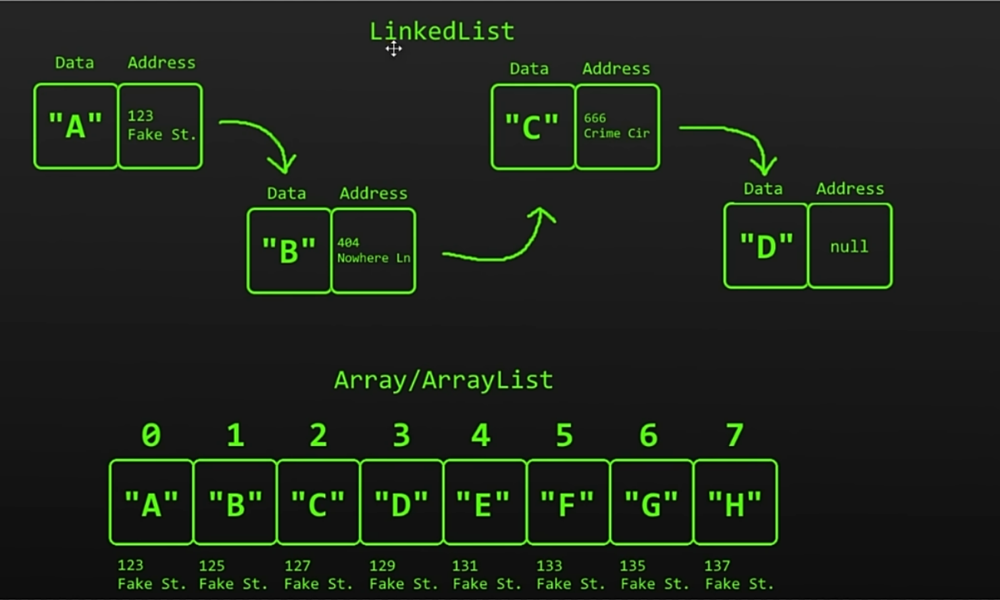
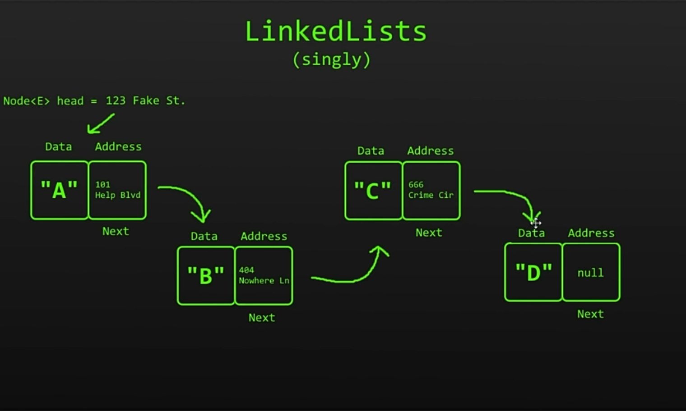
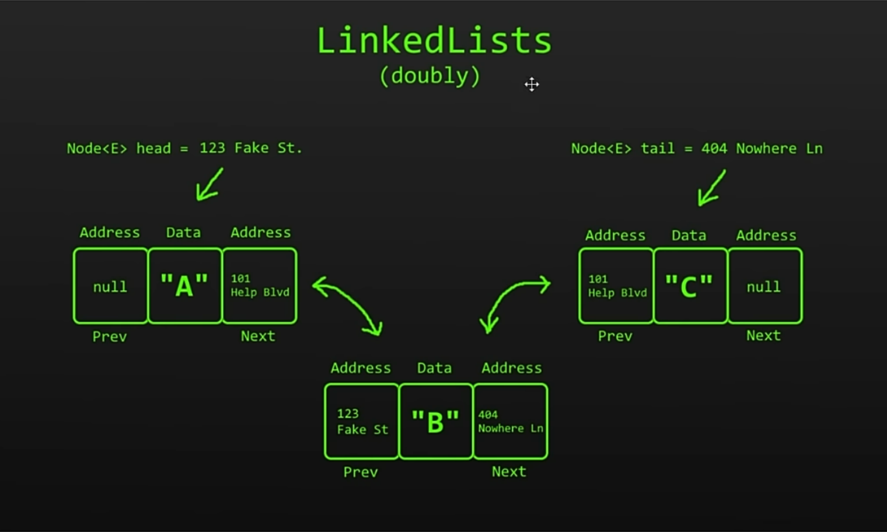

## Array List
- Arrays and ArrayLists store data in contigous memory locations
- better at randomly accessing elements as they have an index 0(1)
- not great at insertion,deletion o(n) 

## Linked List

- has a chain of nodes
- takes more memory/data
- each node has the data to store and a pointer to next node
- insertion , deletion easy O(1)
- bad at searching O(n)

